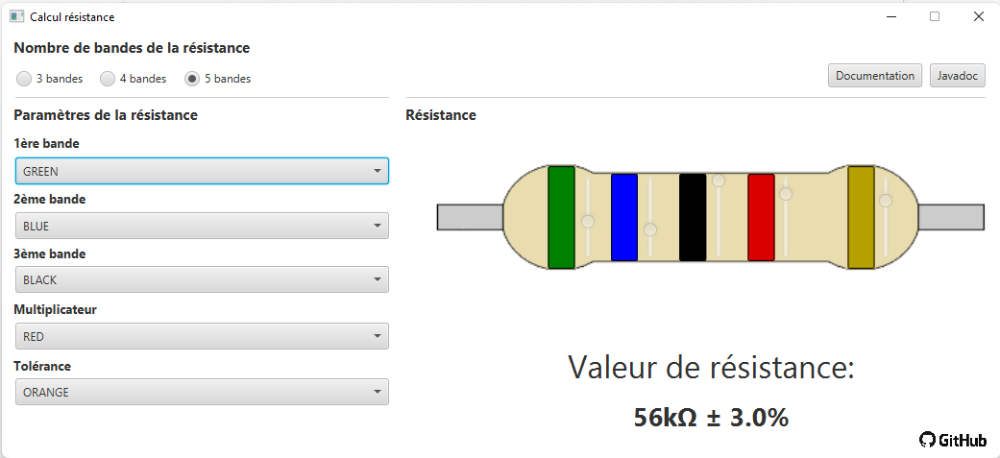

# Avant de commencer

Cette documentation ainsi que la javadoc étaient accessibles sur un site web hébergé chez moi à la livraison de la production. Cependant, suite à une mise à jour de la box SFR apparemment irréversible, le menu NAT de ma box a disparu, il m'est alors impossible de faire de la translation d'adresses et de continuer d'héberger des sites web.

Le Javadoc est disponible dans le dossier resistances-javafx/javadoc.

*Mise à jour au 18/02/22: la doc et la javadoc sont de nouveau accessibles.*

# Documentation

Bienvenue dans la documentation du projet **resistances-javafx** de Nathan RANAIVO et Lucas LANDAIS.
Cette documentation vous permettra d'avoir une vision d'ensemble sur le fonctionnement de l'application et de ses fonctionnalités. 

Cette documentation est également disponible [ici](https://resistances-javafx.docs.zazadago.fr) et le javadoc est disponible [ici](https://resistances-javafx.javadoc.zazadago.fr).

## Introduction

Ce projet a été réalisé dans le cadre de l'évaluation du module **IHM** de **CIPA4** option **GL**.

## Objectif du projet

Le but du projet est donc de programmer une application capable de calculer la valeur d’une résistance a l’aide de son code couleur qui doit être indiqué par l’utilisateur. Le projet a dû être 
écrit en Java en utilisant les technologies JavaFX et SceneBuilder. 
L'IDE qu'on a choisi d'utiliser a été Intellij.

Nous avons eu la possibilité d'être libres de nos actions et d'ajouter des fonctionnalités qui ne sont pas demandées, dans l'objectif d'améliorer le programme et de traiter tous les cas de figure pouvant entraîner un blocage dans le déroulement de l'application.

## Déroulement de l'application

* Lancer l'application.
  
* L'utilisateur se retrouve sur la fenêtre principale avec comme première possibilité de choisir le nombre de bandes de la résistance à calculer.
* Il peut indiquer a présent les couleurs des bandes soit par les menus déroulants dans la partie gauche de la fenêtre, soit par les sliders situés directement à droite de chacune des bandes. 
* La résistance calculée se met à jour automatiquement au fur et à mesure que l'utilisateur effectue ses changements.

## Description des fonctionnalités

### Changement de bandes

L'utilisateur a 3 possibilités de sélection : _3 bandes_, _4 bandes_ et _5 bandes_. Nous avons basé notre interface graphique sur une image de résistance a 5 bandes qui est également la résistance 
par défaut au lancement de l'application. La voici :

#### Calcul d'une résistance à 5 bandes

Les **3 premières bandes** sont les **chiffres significatifs** de la résistance qui vont permettre de déterminer la valeur de la résistance. La **4ème bande** est le **mutiplicateur** qui va se multiplier a la valeur calculée précedemment, puis la **5ème bande** indique la **tolérance**, qui détermine la marge d'erreur du calcul de la résistance.

#### Calcul d'une résistance à 4 bandes

Le calcul est le même que pour une résistance a 5 bandes à la différence près que la **3ème bande** n'existe pas, il y a donc pas de **3ème chiffre significatif** dans le calcul. 

La **3ème bande** disparaît de l'interface quand une résistance à 4 bandes est sélectionnée. Il en est de même pour le slider associé, et le menu déroulant correspondant est désactivé.

#### Calcul d'une résistance à 3 bandes

Le calcul est le même que pour une résistance à 4 bandes, moins la **bande de tolérance** qui disparaît de l'interface avec son slider et le menu correspondant.

La **5ème bande** et la **3 eme bande** ne sont donc pas présents sur l'interface.

Il est à noter que a tolérance est fixée a **20%** dans le cas d'une résistance a 3 bandes.
